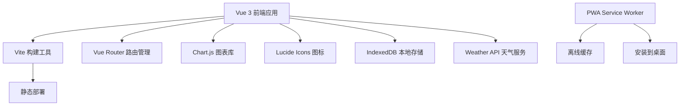
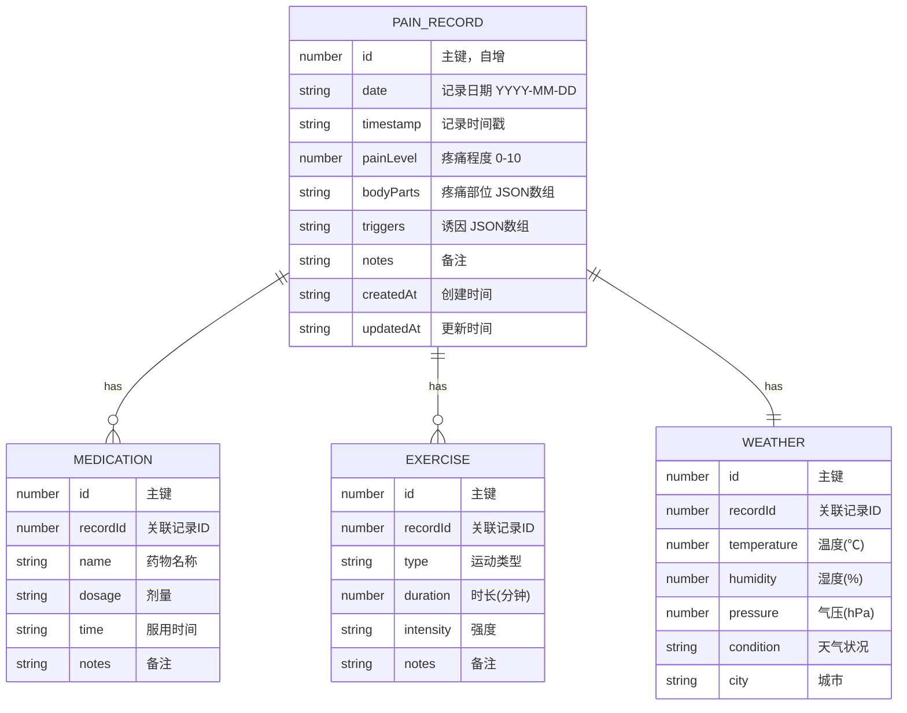

## 1. 架构设计



## 2. 技术描述

- **前端框架**：Vue 3 + TypeScript + Composition API
- **构建工具**：Vite 5.x
- **路由管理**：Vue Router 4.x
- **样式方案**：Tailwind CSS 3.x
- **图表库**：Chart.js 4.x + vue-chartjs
- **本地存储**：IndexedDB（使用 idb 封装库）
- **PWA支持**：vite-plugin-pwa
- **图标库**：lucide-vue-next
- **部署方式**：纯静态站点，vite build 后可直接部署

## 3. 路由定义

| 路由 | 页面 | 功能 |
|------|------|------|
| / | 首页/记录主页 | 今日概览、快速记录入口 |
| /record | 记录页面 | 完整的疼痛记录表单（部位、程度、诱因等） |
| /body | 部位标注 | 人体图交互标注 |
| /trends | 趋势分析 | Chart.js 周/月趋势图表 |
| /history | 历史记录 | 记录列表、筛选、删除 |
| /settings | 设置 | 数据导出、清除数据、关于 |

## 4. 数据模型

### 4.1 数据模型定义



### 4.2 IndexedDB Store 定义

```typescript
// 数据库名称和版本
const DB_NAME = 'pain-diary-db';
const DB_VERSION = 1;

// Object Stores
interface PainRecord {
  id?: number;
  date: string;
  timestamp: string;
  painLevel: number;
  bodyParts: string[];
  triggers: string[];
  notes?: string;
  createdAt: string;
  updatedAt: string;
}

interface Medication {
  id?: number;
  recordId: number;
  name: string;
  dosage: string;
  time: string;
  notes?: string;
}

interface Exercise {
  id?: number;
  recordId: number;
  type: string;
  duration: number;
  intensity: 'low' | 'medium' | 'high';
  notes?: string;
}

interface Weather {
  id?: number;
  recordId: number;
  temperature: number;
  humidity: number;
  pressure: number;
  condition: string;
  city: string;
}
```

## 5. 项目结构

```
src/
├── components/          # 可复用组件
│   ├── BodyMap.vue          # 人体图组件
│   ├── PainSlider.vue       # 疼痛评分滑块
│   ├── TagSelector.vue      # 标签选择器
│   ├── TrendChart.vue       # 趋势图组件
│   ├── RecordCard.vue       # 记录卡片
│   └── BottomNav.vue        # 底部导航
├── composables/         # 组合式函数
│   ├── useIndexedDB.ts      # IndexedDB 封装
│   ├── usePainRecord.ts     # 疼痛记录逻辑
│   ├── useWeather.ts        # 天气API
│   └── useTrends.ts         # 趋势分析逻辑
├── pages/               # 页面组件
│   ├── Home.vue             # 首页
│   ├── Record.vue           # 记录页
│   ├── BodyMapPage.vue      # 部位标注页
│   ├── Trends.vue           # 趋势分析页
│   ├── History.vue          # 历史记录页
│   └── Settings.vue         # 设置页
├── types/               # TypeScript 类型定义
│   └── index.ts
├── utils/               # 工具函数
│   ├── date.ts              # 日期处理
│   └── export.ts            # 数据导出
├── App.vue
├── main.ts
├── router.ts            # 路由配置
└── style.css            # 全局样式
```

## 6. PWA 配置

- **manifest.json**：配置应用名称、图标、主题色
- **Service Worker**：使用 vite-plugin-pwa 自动生成
- **缓存策略**：
  - 静态资源：CacheFirst
  - API 请求：NetworkFirst
  - IndexedDB 数据：本地存储，不缓存

## 7. 构建与部署

- **开发命令**：`npm run dev`
- **构建命令**：`npm run build`
- **预览命令**：`npm run preview`
- **部署方式**：将 `dist/` 目录部署到任何静态文件服务器（Nginx、GitHub Pages、Vercel、Netlify 等）
